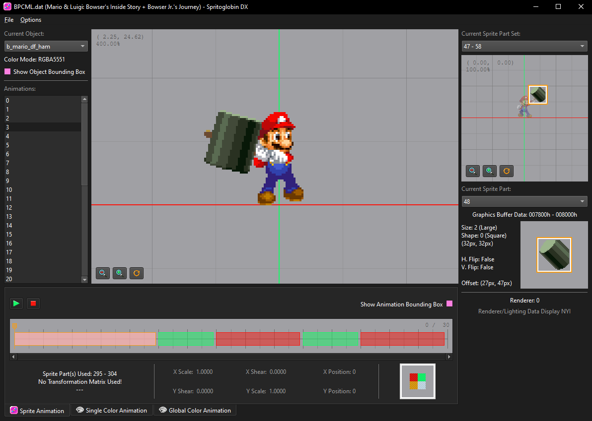

# Spritoglobin DX
Spritoglobin DX is a sprite viewer for Mario and Luigi: Bowser's Inside Story + Bowser Jr.'s Journey, as well as a growing list of other Mario & Luigi titles.



# Credits
[ThePurpleAnon](https://bsky.app/profile/thepurpleanon.bsky.social)  - Python Code, UI Design, and Program Sounds

[DimiDimit](https://github.com/DimiDimit)  - Additional Python Code and Cleanup

[MiiK](https://bsky.app/profile/miikheaven.bsky.social)  - Spritoglobin DX Icon and Program UI Icons

[8y8x](https://github.com/8y8x)  - Assistance with 3D Renderer Code

Translators:
- Español (ES)  - [Danius](https://github.com/Dani88alv) 
- Français (FR)  - [Yo-New 3DS](## "Discord: yo_2ds") 
- Português  - [Shaino](https://www.instagram.com/im__shine_o?igsh=Mjl3YmZlaWswaW5x) 

# Running the Program
There are 4 ways to run this program, from easiest to most complicated:

1. Download the binary from [Releases](https://github.com/MnL-Modding/Spritoglobin-DX/releases) and run it. (Use the `.exe` for Windows, and the `.bin` for Linux)

2. Install the package with
```bash
python3 -m pip install --force-reinstall git+https://github.com/MnL-Modding/Spritoglobin-DX
```
and run it with `spritoglobin_dx` or `python3 -m spritoglobin_dx`.

3. Clone the repository, install the dependencies with Poetry (assuming you already have Poetry installed with `python3 -m pip install poetry`):
```bash
poetry install
```
and run the program through Poetry:
```bash
poetry run spritoglobin-dx
```

4. Clone the repository, install the dependencies through `pip` with:
```bash
python3 -m pip install -r requirements.txt
```
and run it from the current directory with `python3 -m spritoglobin_dx`. Alternatively, it can be run through the `run.bat` if you use Windows.
